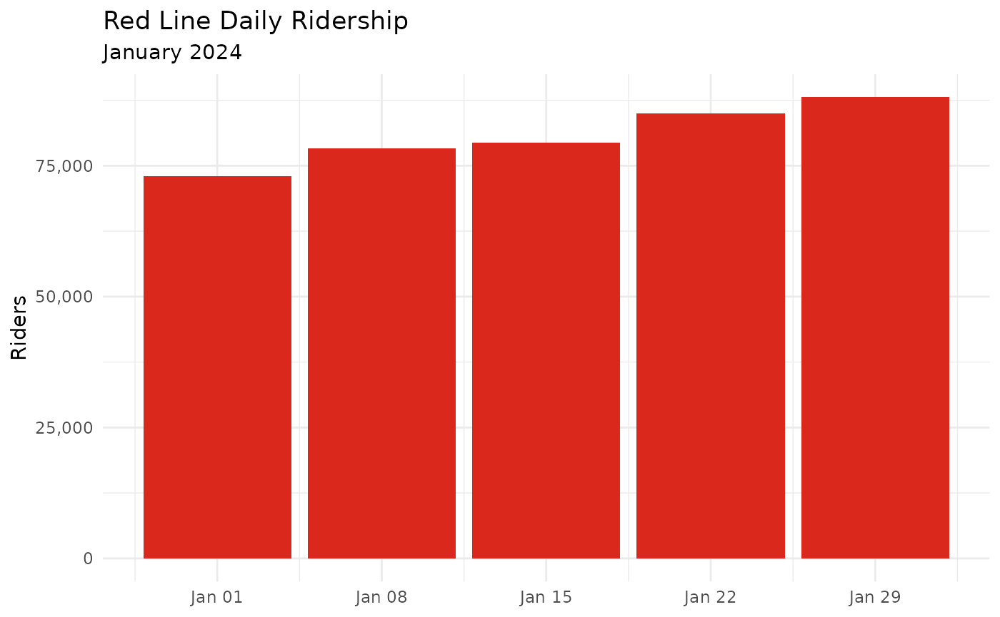
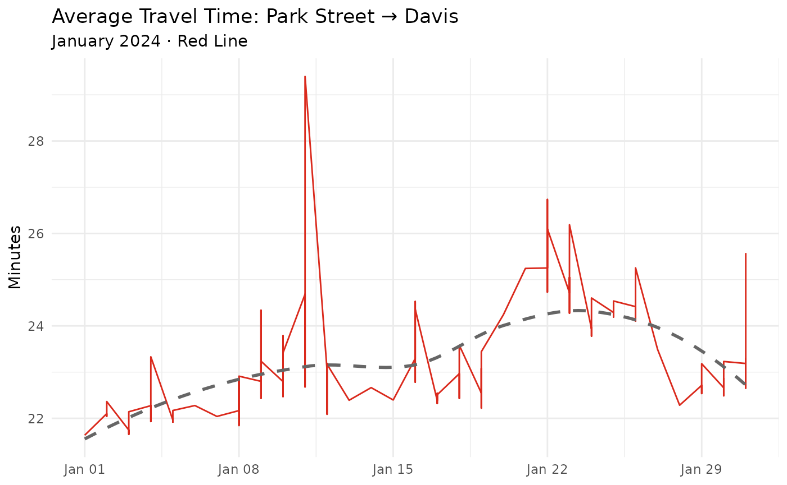
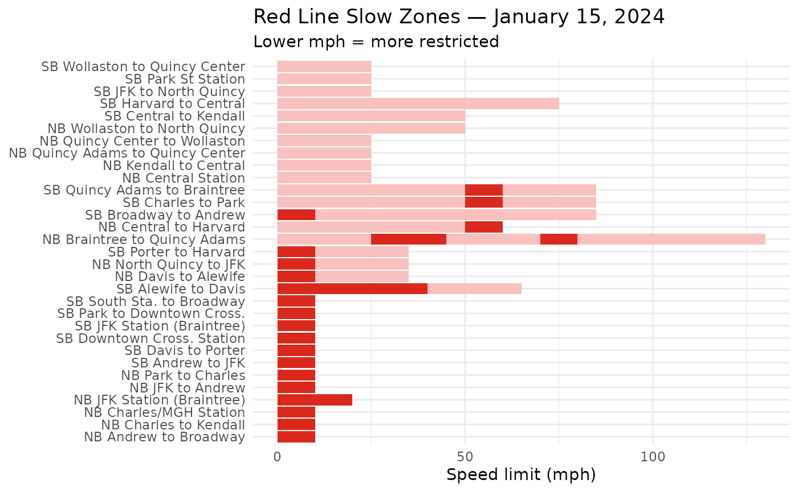

# Red Line Analysis: A Worked Example

This vignette walks through a realistic analysis of Red Line performance
in January 2024. By the end you’ll have three charts:

1.  Daily ridership
2.  Average travel time from Park Street → Davis
3.  Where slow zones were on a specific day

## Setup

``` r

library(transitmattr)
library(dplyr)
#> 
#> Attaching package: 'dplyr'
#> The following objects are masked from 'package:stats':
#> 
#>     filter, lag
#> The following objects are masked from 'package:base':
#> 
#>     intersect, setdiff, setequal, union
library(ggplot2)
```

> **New to these packages?** `dplyr` is for cleaning and reshaping data;
> `ggplot2` is for charts. Install them with
> `install.packages(c("dplyr", "ggplot2"))` if needed.

## 1. Daily ridership

### Pull the data

``` r

ridership_raw <- tm_ridership(
  start_date = "2024-01-01",
  end_date   = "2024-01-31",
  line_id    = "line-Red"
)
```

`ridership_raw` is a **list** where each item represents one day’s
record. Let’s flatten it into a data frame:

``` r

library(dplyr)
ridership_df <- bind_rows(ridership_raw)
head(ridership_df)
#> # A tibble: 5 × 2
#>   date       count
#>   <chr>      <int>
#> 1 2024-01-01 72986
#> 2 2024-01-08 78348
#> 3 2024-01-15 79336
#> 4 2024-01-22 84922
#> 5 2024-01-29 88096
```

### Explore the columns

``` r

glimpse(ridership_df)
#> Rows: 5
#> Columns: 2
#> $ date  <chr> "2024-01-01", "2024-01-08", "2024-01-15", "2024-01-22", "2024-01…
#> $ count <int> 72986, 78348, 79336, 84922, 88096
```

### Plot it

``` r

library(ggplot2)
ggplot(ridership_df, aes(x = as.Date(date), y = count)) +
  geom_col(fill = "#DA291C") +
  scale_y_continuous(labels = scales::comma) +
  labs(
    title = "Red Line Daily Ridership",
    subtitle = "January 2024",
    x = NULL,
    y = "Riders"
  ) +
  theme_minimal()
```



> **What to notice:** Weekends typically show lower ridership. If a day
> is unusually low on a weekday, there may have been a service
> disruption — check
> [`tm_alerts()`](https://transitmatters.github.io/transitmattr/reference/tm_alerts.md)
> for that date.

## 2. Travel time from Park Street to Davis

This uses the **aggregate** endpoint, which gives you long-run averages
rather than individual trips.

### Stop IDs

Travel time endpoints need **platform stop IDs**, not parent station
IDs. Each station has separate IDs for each direction (northbound toward
Alewife = `0`, southbound = `1`).

| Station           | Northbound (→ Alewife) | Southbound (→ Ashmont/Braintree) |
|-------------------|------------------------|----------------------------------|
| Alewife           | `70061`                | `70061`                          |
| Davis             | `70064`                | `70063`                          |
| Porter            | `70066`                | `70065`                          |
| Harvard           | `70068`                | `70067`                          |
| Central           | `70070`                | `70069`                          |
| Kendall/MIT       | `70072`                | `70071`                          |
| Charles/MGH       | `70074`                | `70073`                          |
| Park Street       | `70076`                | `70075`                          |
| Downtown Crossing | `70078`                | `70077`                          |
| South Station     | `70080`                | `70079`                          |

### Pull the data

``` r

# Northbound: Park Street (70076) → Davis (70064)
travel_raw <- tm_aggregate_travel_times2(
  from_stop  = "70076",
  to_stop    = "70064",
  start_date = "2024-01-01",
  end_date   = "2024-01-31"
)
```

### Clean it up

``` r

library(dplyr)
travel_df <- bind_rows(travel_raw$by_date)

# Travel times come back in seconds — convert to minutes
travel_df <- travel_df |>
  mutate(
    date       = as.Date(service_date),
    travel_min = mean / 60
  )

head(travel_df)
#> # A tibble: 6 × 15
#>   `25%` `50%` `75%` count holiday   max  mean   min peak  service_date   std
#>   <dbl> <dbl> <dbl> <int> <lgl>   <dbl> <dbl> <dbl> <chr> <chr>        <dbl>
#> 1 1235. 1270. 1334.   112 TRUE     2011 1298.  1132 all   2024-01-01   108. 
#> 2 1251  1302  1362    133 FALSE    2234 1326.  1178 all   2024-01-02   128. 
#> 3 1237. 1294. 1356    132 FALSE    1572 1305.  1172 all   2024-01-03    82.6
#> 4 1257. 1308. 1370.   130 FALSE    2674 1336.  1178 all   2024-01-04   156. 
#> 5 1241  1288  1344.   131 FALSE    2305 1318.  1167 all   2024-01-05   135. 
#> 6 1230. 1304. 1379    116 FALSE    1893 1337.  1134 all   2024-01-06   142. 
#> # ℹ 4 more variables: sum <dbl>, weekend <lgl>, date <date>, travel_min <dbl>
```

### Plot it

``` r

library(ggplot2)
ggplot(travel_df, aes(x = date, y = travel_min)) +
  geom_line(color = "#DA291C") +
  geom_smooth(method = "loess", se = FALSE, linetype = "dashed",
              color = "grey40") +
  labs(
    title    = "Average Travel Time: Park Street → Davis",
    subtitle = "January 2024 · Red Line",
    x        = NULL,
    y        = "Minutes"
  ) +
  theme_minimal()
#> `geom_smooth()` using formula = 'y ~ x'
```



> **Dashed line** is a smooth trend. If travel times creep up over time
> it can signal slow zones accumulating — which leads us to section 3.

## 3. Slow zones on a specific day

Speed restrictions (“slow zones”) are places where trains must go slower
than normal, usually because of track issues.

``` r

slow_raw <- tm_speed_restrictions("line-Red", "2024-01-15")
```

``` r

library(dplyr)
if (!isTRUE(slow_raw$available)) {
  message("No slow zone data available for this date.")
} else {
  slow_df <- bind_rows(slow_raw$zones)
  glimpse(slow_df)
}
#> Rows: 60
#> Columns: 11
#> $ date        <chr> "2024-01-15", "2024-01-15", "2024-01-15", "2024-01-15", "2…
#> $ trackFeet   <int> 699, 412, 599, 500, 300, 86, 475, 99, 513, 100, 100, 800, …
#> $ reason      <chr> "Track", "Track", "Track", "Track", "Track", "Track", "Tra…
#> $ speedMph    <int> 10, 10, 25, 10, 10, 10, 10, 25, 10, 10, 25, 25, 25, 25, 25…
#> $ fromStopId  <chr> "place-pktrm", "place-andrw", "place-chmnl", "place-chmnl"…
#> $ reported    <chr> "2023-08-25", "2023-08-01", "2023-08-02", "2023-10-19", "2…
#> $ lineId      <chr> "line-Red", "line-Red", "line-Red", "line-Red", "line-Red"…
#> $ description <chr> "SB Park to Downtown Cross.", "SB Andrew to JFK", "SB Char…
#> $ id          <chr> "572027", "565480", "567089", "000108R", "000108R", "50852…
#> $ toStopId    <chr> "place-dwnxg", "place-jfk", "place-pktrm", "place-knncl", …
#> $ direction   <chr> "SB", "SB", "SB", "NB", "NB", "NB", "NB", "NB", "NB", "SB"…
```

``` r

library(ggplot2)
# Each row is a slow zone segment; visualize by location and speed limit
ggplot(slow_df, aes(x = reorder(description, speedMph), y = speedMph, fill = speedMph)) +
  geom_col() +
  coord_flip() +
  scale_fill_gradient(low = "#DA291C", high = "#f9c0c0") +
  labs(
    title    = "Red Line Slow Zones — January 15, 2024",
    subtitle = "Lower mph = more restricted",
    x        = NULL,
    y        = "Speed limit (mph)"
  ) +
  theme_minimal() +
  theme(legend.position = "none")
```



> **Note:** If `slow_raw$available` is `FALSE`, there were no active
> slow zones that day. Try a different date or check during a period
> with known track work.

## 4. Putting it all together

Here’s a pattern you’ll use over and over: **pull → bind_rows → mutate →
ggplot**. Once you’re comfortable with it, try exploring:

- [`tm_aggregate_headways()`](https://transitmatters.github.io/transitmattr/reference/tm_aggregate_headways.md)
  — how often trains come, over time
- [`tm_line_delays()`](https://transitmatters.github.io/transitmattr/reference/tm_line_delays.md)
  — delay minutes caused by alerts
- [`tm_trip_metrics()`](https://transitmatters.github.io/transitmattr/reference/tm_trip_metrics.md)
  — on-time performance per trip

## Troubleshooting

| Problem | What to try |
|----|----|
| [`bind_rows()`](https://dplyr.tidyverse.org/reference/bind_rows.html) gives an error | Use `str(raw_result)` to see the exact structure, then drill in with `$` |
| All values are `NULL` | The API may have no data for that date; try a nearby weekday |
| Columns have unexpected names | Run `names(df)` and adjust your [`mutate()`](https://dplyr.tidyverse.org/reference/mutate.html) references |
| The API call fails | Run [`tm_healthcheck()`](https://transitmatters.github.io/transitmattr/reference/tm_healthcheck.md) to verify the API is up |
